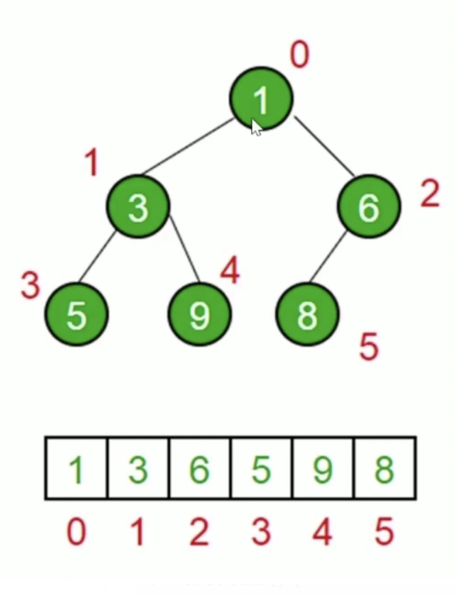

### 数据结构

#### 栈

- js 中没有栈，我们要使用一个数组来模拟一个栈。
- 先进后出的场景。
- js 中的任务栈。

#### 队列

- js 中没有队列，我们要使用数组来模拟一个队列。
- 先进先出的场景。
- js 中的任务队列。

#### 链表

- js 中没有链表，我们要使用 object 来模拟一个链表。
- js 中的原型链

#### 集合

- ES6 中存在集合，为 Set。
- 一种无序且唯一的结构。

#### 字典

- ES6 中存在字典，为 Map。
- 存储唯一值，用键值对表示。

#### 树

- 一种分层数据的抽象模型。
- js 中的：DOM 树，级联选择...
- 对应的遍历
  - [深度遍历](https://github.com/hongguang-alt/data-structure/blob/master/Tree/dfs.js)——[先序](https://github.com/hongguang-alt/data-structure/blob/master/Tree/preorder.js)，[中序](https://github.com/hongguang-alt/data-structure/blob/master/Tree/midorder.js)，[后序](https://github.com/hongguang-alt/data-structure/blob/master/Tree/lastorder.js)。
  - [广度遍历](https://github.com/hongguang-alt/data-structure/blob/master/Tree/bfs.js)。

#### 图

- 图是网络结构的抽象模型。
- js 中没有图，可以使用 object 和 Array 来模拟。
  - 邻接矩阵。
  - 邻接表。
- 对应的遍历
  - [深度优先](https://github.com/hongguang-alt/data-structure/blob/master/Graph/dfs.js)。
  - [广度优先](https://github.com/hongguang-alt/data-structure/blob/master/Graph/bfs.js)。

#### 堆

- 堆是一种特殊的完全二叉树
- 所有节点都大于等于（最大堆）或者小于等于（最小堆）他的子节点。
- js 通常用数组表示堆
  - 左侧子节点的位置为 2 \* index + 1
  - 右侧子节点的位置为 2 \* index + 2
  - 父节点的位置是 （index - 1） / 2

- 对应的方法
  - [实现最小堆](https://github.com/hongguang-alt/data-structure/blob/master/Heap/minHeap.js)

#### 排序

- [冒泡排序](https://github.com/hongguang-alt/data-structure/blob/master/Sort/bubble.js)
- [选择排序](https://github.com/hongguang-alt/data-structure/blob/master/Sort/select.js)
- [插入排序](https://github.com/hongguang-alt/data-structure/blob/master/Sort/insert.js)
- [归并排序](https://github.com/hongguang-alt/data-structure/blob/master/Sort/merge.js)
- [快速排序](https://github.com/hongguang-alt/data-structure/blob/master/Sort/quick.js)

#### 搜索

- [顺序搜索](https://github.com/hongguang-alt/data-structure/blob/master/Search/sequential.js)
- [二分搜索](https://github.com/hongguang-alt/data-structure/blob/master/Search/binary.js)

#### 算法思想

- 分而治之
- 动态规划
- 贪心算法
- 回溯算法

未完待续......
